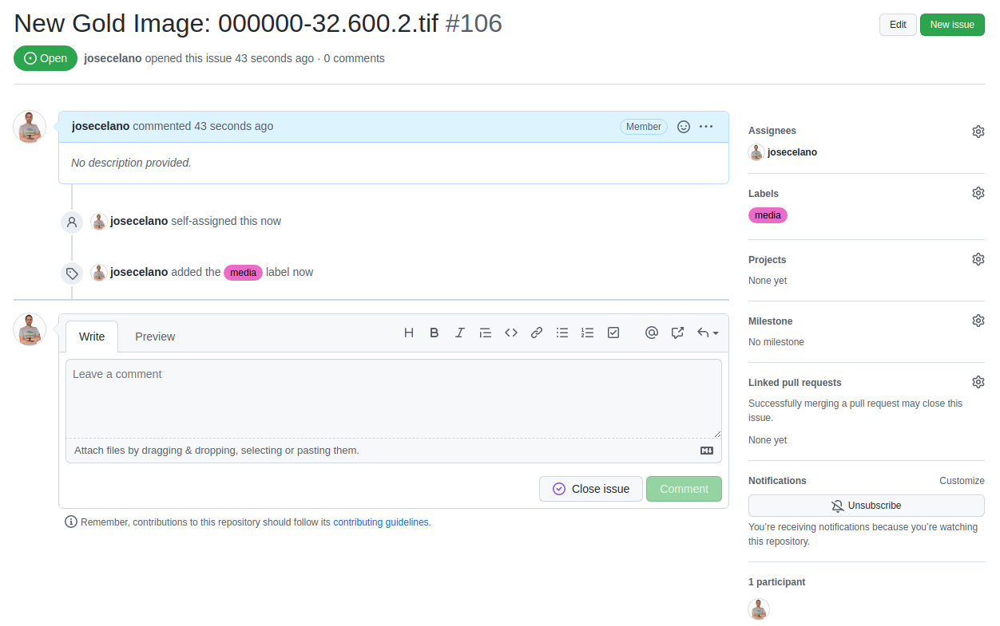
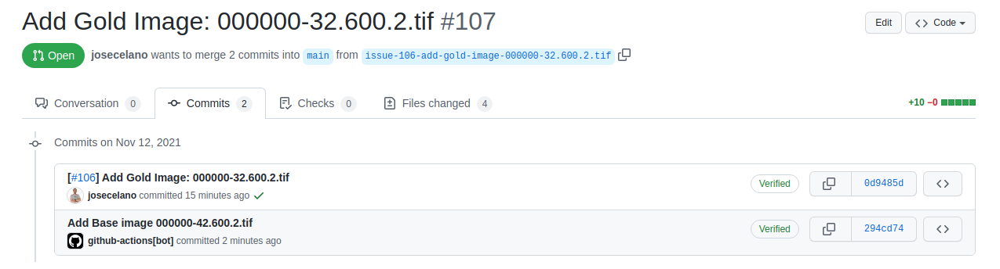
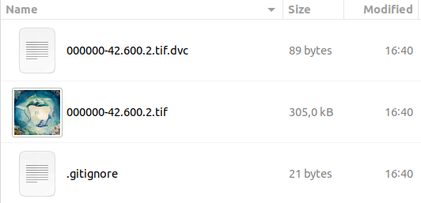

# Media Contributor Guide

Generic informaction about Gold Images on the ["Gold Images"](./Gold_Images.md) documentation.

1. [How to add a new Gold Drawing](#how-to-add-a-new-gold-drawing)
2. [How to update a Gold Drawing](#how-to-update-a-gold-drawing)

## How to add a new Gold Drawing

1. [Generate filename](#1-generate-filename)
2. [Place the image in the correct folder](#2-place-the-image-in-the-correct-folder)
3. [Create a new issue and branch](#3-create-a-new-issue-and-branch)
4. [Add the new image locally](#4-add-the-new-image-locally)
5. [Share the new image remotely](#5-share-the-new-image-remotely)
6. [Create the new pull request](#6-create-the-new-pull-request)
7. [Validate and merge the pull requests](#7-validate-and-merge-the-pull-requests)
8. [New version of the website deployed](#8-new-version-of-the-website-deployed)

In this tutorial, you will learn how to add a new Gold Drawing image to the library.

You can watch the whole screen capture of this tutorial on [YouTube](https://youtu.be/Nf-ePEdA5xc).

### 1. Generate filename

We start with the original artwork: `00IWO.tif` (276,3 MB). It's a `tif` image.

The first thing we need to do is to give it the right name: `000000-32.600.2.tif`

Please read the [File Name Convention](./File_Naming_Convention.md) documention for more information.

- `000001` is the artwork id. It is a sequential number manually assigned by the media contributor.
- `32` is the `purpose code`. It means the image is a Gold Drawing.
- `600` is the code for `original` images.
- `2` is the suffix for image files. We could also upload other file types like metadata (in `json` format).

### 2. Place the image in the correct folder

We copy the image into the data folder: `data/000001/32/`. We have a folder for all artifacts related to the same artwork (`data/000001`) and another one inside the first one for all `Gold` images (`32/`).

### 3. Create a new issue and branch

We follow a pull request process to add new images to the library. That means the media contributor has to create an issue and a new branch for the issue. Then, the new image has to be added to that branch (only the `dvc` files, not the binary file) and the image has to be uploaded to the `dvc` storage. Once we have all the information and data on GitHub and DVC, the media contributor has to create a pull request.

The process to create a new issue is just the standard process for GitHub. You can use this template:

- Issue title: "New Gold Drawing: 000000-32.600.2.tif"
- Issue description: whatever the media contributor considers relevant.
- Label: `media`



We also need to create a new branch. The command to do it using git from the console is:

```shell
git checkout -b issue-106-add-gold-image-000000-32.600.2.tif
```

Make sure you are in the `main` branch and you have the latest version.

### 4. Add the new image locally

We are using `dvc` to store the image. That means the actual image will be stored on the `dvc` storage and we will only add two files into the git repo.

First, we use the `dvc` client to add the new image. We have already added the image in the rigth folder. The `dvc` command is:

```shell
dvc add data/000000/32/000000-32.600.2.tif
```

That command will copy the image in the local `dvc` cache folder and it will generate two new files:

```shell
data/000000/32/000000-32.600.2.tif.dvc
data/000000/32/.gitignore
```

The first file is what we call the `dvc` pointer. It's just an small file that is used by `dvc` to track the file with git. This is the content for our example:

```text
outs:
- md5: 32b0d05acaadf5e1d5f6b67641678b1c
  size: 273627048
  path: 000000-32.600.2.tif
```

The second file is only a `.gitignore` file to avoid git tracking the actual binary file. It only contains the name of the image file (`/000000-32.600.2.tif`).

We need to commit the changes. We have to add them:

```shell
git add data/000000/32/000000-32.600.2.tif.dvc data/000000/32/.gitignore
```

and then, commit:

```shell
git commit -m "[#106] Add Gold Drawing: 000000-32.600.2.tif"
```

The template for the commit message is:

```text
[#ISSUE_NUMBER] Add Gold Drawing: GOLD_IMAGE_FILENAME
```

At this point, we have the image locally in our branch. We need to apply our changes remotely:

- Push our new git commit.
- Copy the image to the remote `dvc` storage.

> TIP: you can list all the files handled with `dvc` in the library with this command: `dvc list --dvc-only -R data/`.

### 5. Share the new image remotely

Before pushing our new branch, we should push the image into the remote `dvc` storage. Otherwise, other people are going to have access to the new `dvc` pointer in the git repo, but they will not be able to download the image.

The way to share our local image is by using the `dvc` command [`push`](https://dvc.org/doc/command-reference/push):

```shell
dvc push
```

Make sure you have set the credentials before writing on the remote storage. We are using Azure Blob Storage for the first proof of concept. You can authenticate the `dvc` client with a SAS token using environment variables:

```shell
export AZURE_STORAGE_ACCOUNT='nautiluscyberneering'
export AZURE_STORAGE_SAS_TOKEN='?sv=2020-08-04&ss=xxx=sco&sp=xxx&se=2021-12-31T19:15:33Z&st=2021-10-01T10:15:33Z&spr=https&sig=xxx'
```

You can find those variables in the [template file for environment varaibles](../.secrets.ci).

After pushing the image, you also need to push your git changes with:

```shell
git push --set-upstream origin issue-106-add-gold-image-000000-32.600.2.tif
```

Now we have the new branch with the new image ready to create the pull request.

### 6. Create the new pull request

You can use the GitHub interface or you can use the link provided after pushing using the git from console. The pull request should look like:


You can also use the `media` label.

The PR is going to trigger the [workflow to process the Gold Drawings](../.github/workflows/gold-drawings-processing.yml).

What this worflow does is:

- Use `dvc diff` command to detect the new Gold image.
- Validate the filename, folder and size of the image.
- Generate a Base image from the Gold. It's an smaller version of the image.

When the workflow finishes you should see two new commits in your pull request branch.



One commit should be your own commit adding the new Gold Drawing. And the other commit should be the automatic commit generated by the workflow adding the corresponding Base image.

You can check if the workflow has generated the correct Base image by downloading it to you local machine.

```shell
git pull && dvc pull
```

After running that command you should see the new Base image along with the `dvc` files (pointer and gitignore) for the Base image:



### 7. Validate and merge the pull requests

If there is no error, a maintainer can merge the pull request. This role should be a media maintainer in charge of the image collection.

The merge event is going to trigger another [workflow to update the website project](../.github/workflows/update-website.yml).

### 8. New version of the website deployed

If there is no error in the previous steps you should see the new Gold drawing on the website: https://nautilus-cyberneering.github.io/chinese-ideographs-website.

The website contains another workflow which is triggered by the [update-website workflow](../.github/workflows/update-website.yml). That workflow obtains the image from the `dvc` storage and convert it to `JPG` format. It also copies the image inside the git repo (it's not using git LFS). You can get more information about that process on the [website repository](https://github.com/Nautilus-Cyberneering/chinese-ideographs-website).

## How to update a Gold Drawing

In this tutorial, you will learn how to update a Gold Drawing to the library.

NOTE: The intention is to update an image. If you want to add the artist revision or edition, that's a different artwork, so you should add a new image. The "update" case should only be used when you want to fix a wrong image (invalid, file, corrupted file, wrong content, etcetera).

You can watch the whole screen capture of this tutorial on [YouTube](https://youtu.be/CB5hZGWcs8o).

TODO.

NOTE: we are still considering how the "update" process should be: https://github.com/Nautilus-Cyberneering/chinese-ideographs/pull/122#issuecomment-972844365.

Once we define the proccess, we will update this documentation.
