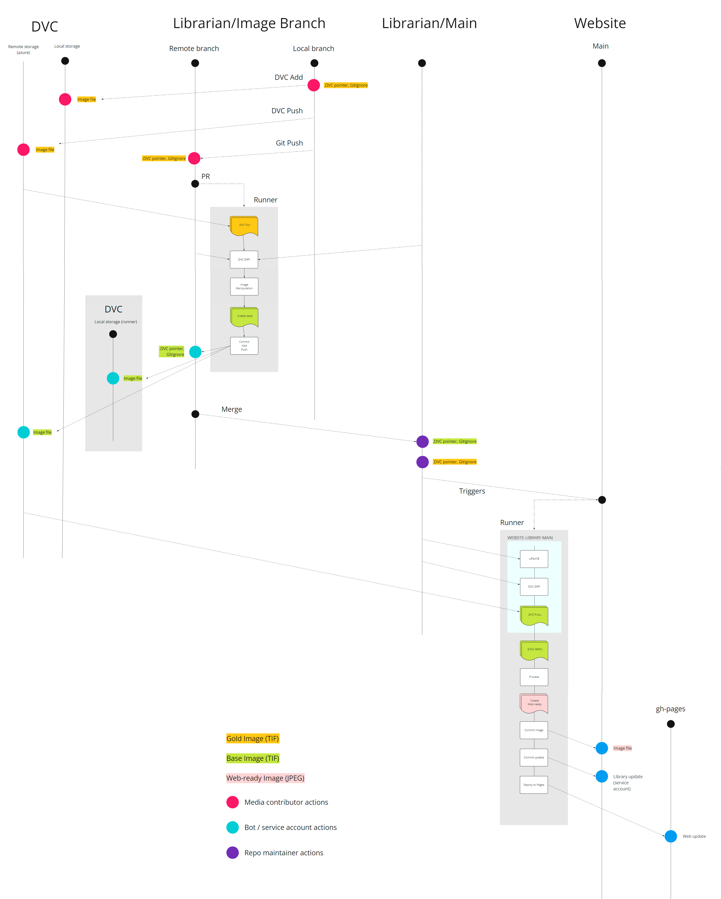

# About this document

The usage of the chinese ideograph services and features implies several interdependant processes both triggered by humans and automation systems.

In this document we will review an end-to-end typical use case: the addition of a "gold" image to the repository: the actions that must be done by the users and the actions it triggers.

## Terminology

Please review this document to know more about the different kinds of images that can be present in the repository or its related entites (like a website that consumes it).

## Step 1: Manual image upload

The first step is adding the actual gold image file to the repository. This is detailed in this document, but the summary of it is:

1.1 - Add the image to the local DVC repository using the DVC ADD command. This generates two new files: a .dvc file (pointer) and a .gitignore file.
1.2 - Perform a GIT commit with both files (.dvc, .gitignore) to the local version of this repository, in a new branch (we will call it "image branch").
1.3 - Push the image file to the remote DVC storage with the DVC PUSH command.
1.4 - Push the commit created on 1.2 to the remote branch using the GIT PUSH command.

## Step 2: Gold image processing workflow

2.1 - Create a pull request on the image branch from the previous step.
2.2 - This will trigger a workflow in which the following steps are executed.
  2.2.1 - All the image files are pulled from the remote storage.
  2.2.2 - The remote image branch is compared with the remote main branch to identify changes (Diff)
  2.2.3 - The new images (in our example, the image uploaded in the previous step) are processed to generate the base version images.
  2.2.4 - The base images pointers are uploaded to the DVC remote storage using ADD and PUSH DVC Commands, and their pointers and gitignores are commited and pushed to the image branch.
  
## Step 3: Base images merge and triggered workflows

3.1 - When the PR created in the previous step is approved and merged into the librarian main branch, this may trigger automations in other repositories. In our example, it will trigger a workflow in the _website_ repository that will execute the following steps:
	3.1.1 - The librarian submodule inside the website repository is updated with the latest version of the librarian repository.
	3.1.2 - A DVC Diff is made, comparing the updated version of the librarian repository of the previous one.
	3.1.3 - All the image files are pulled from the remote storage into the librarian submodule, and then copied to the website repository.
	3.1.4 - The base images are processed to generate the web-ready version images.
	3.1.5 - The web-ready images are directly commited to the main branch of the repository (No DVC storage is used).
	3.1.6 - The library submodule update is commited to the main branch of the repository.
	3.1.7 - The gh-pages branch of the website repository, which contain the public web, is updated with the new images.
	
